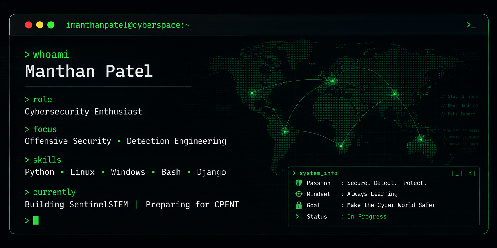

# Hi, I'm Manthan Patel 👋

### 🛡️ Cybersecurity Enthusiast | B.Tech CSE Student

Learning Offensive Security, Detection Engineering, Threat Hunting and building practical security tools.

  

---

# 👨‍💻 About Me

- 🎓 B.Tech Computer Science Student
- 🛡️ Passionate about Cybersecurity
- 💻 Building practical security projects
- 🔍 Currently preparing for **CPENT**
- 🌱 Learning Windows Internals & Active Directory
- 🚀 Open to Cybersecurity Internships

---

# 🚀 Current Projects

- 🛡️ SentinelSIEM
- 📑 SecDocs

---

# ⚒️ Tech Stack

---

# 📊 GitHub Stats

---

# 🏆 GitHub Trophies

---

# 📚 Currently Learning

- Active Directory Security
- Windows Internals
- Detection Engineering
- Malware Analysis
- Privilege Escalation
- Red Team Methodology

---

# 📌 Featured Repositories

⭐ SentinelSIEM

⭐ CyberWrite

⭐ SecDocs

---

# 📫 Connect

---

### 💻 Secure. Detect. Protect.

